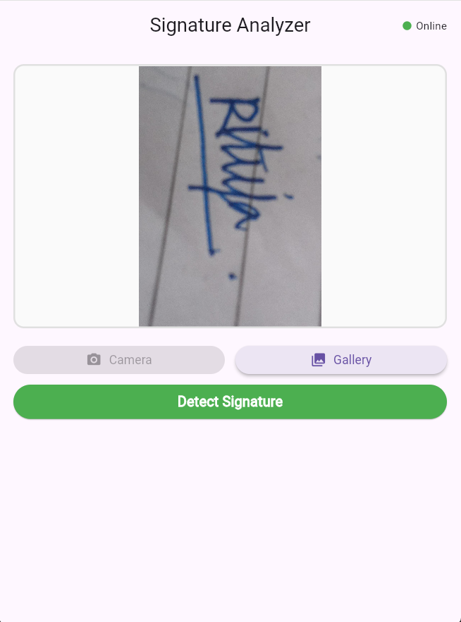
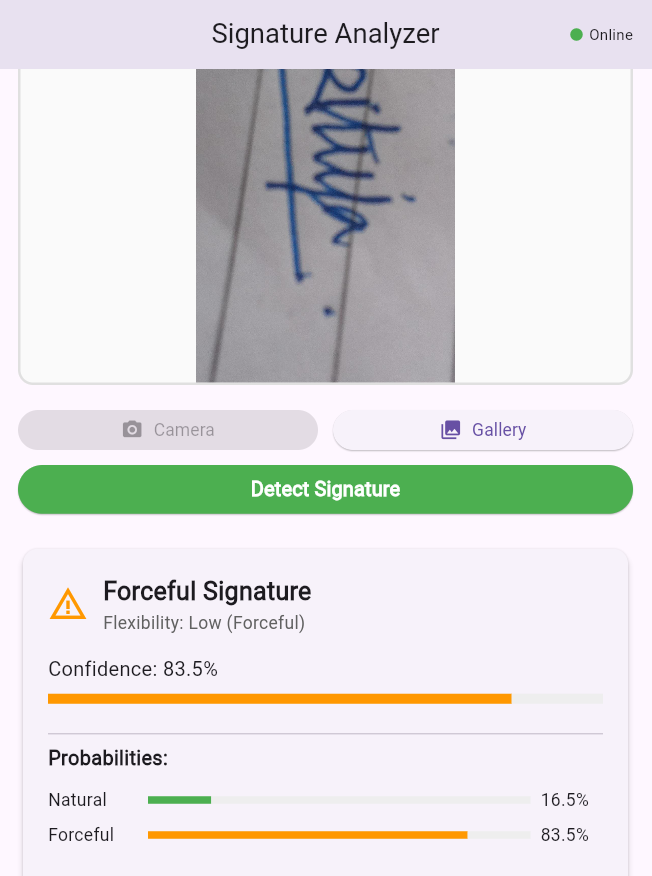
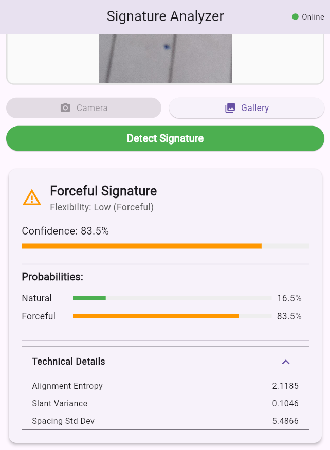

# Signature Analyzer

A Flutter application that analyzes signature images to determine if they were written forcefully or naturally. This app uses machine learning to detect signature authenticity and provides detailed analysis including confidence scores and technical features.

## Features

- **Image Upload**: Capture signatures via camera or select from gallery
- **Real-time Analysis**: Instant detection of signature characteristics
- **Detailed Results**: View confidence levels, flexibility scores, and technical metrics
- **User-Friendly Interface**: Clean, intuitive design with Material 3 styling
- **API Integration**: Connects to a FastAPI backend for signature analysis

## Screenshots

### Home Screen

*The main interface showing the image upload area and analysis options.*

### Analysis Results

*Detailed results showing whether the signature is forceful or natural, with confidence scores.*

### Technical Details

*Expanded view showing technical features like alignment entropy and slant variance.*

## Installation

### Prerequisites
- Flutter SDK (version 3.8.0 or higher)
- Dart SDK
- Android Studio or VS Code with Flutter extensions
- A connected device or emulator

### Setup
1. Clone the repository:
   ```bash
   git clone https://github.com/yourusername/signature_analyzer.git
   cd signature_analyzer
   ```

2. Install dependencies:
   ```bash
   flutter pub get
   ```

3. Configure the API endpoint:
   - Copy the config template:
     ```bash
     cp lib/config/api_config.template.dart lib/config/api_config.dart
     ```
   - Edit `lib/config/api_config.dart` to set your API base URL

4. Run the app:
   ```bash
   flutter run
   ```

## Usage

1. **Launch the App**: Open the app on your device
2. **Upload Image**: 
   - Tap "Gallery" to select from photos
   - Tap "Camera" to capture a new signature
3. **Analyze**: Tap "Analyze Signature" to process the image
4. **View Results**: 
   - See if the signature is "Forceful" or "Natural"
   - Check confidence percentage
   - Expand "Technical Details" for advanced metrics

## API Configuration

The app connects to a FastAPI backend. Configure the following in `lib/config/api_config.dart`:

```dart
class ApiConfig {
  static const String baseUrl = 'https://your-api-endpoint.com';
  static const int timeout = 30;
  static const bool enableLogging = false;
}
```

### API Endpoints
- `GET /health` - Check API health
- `POST /predict` - Analyze signature image

## Project Structure

```
lib/
├── main.dart              # Main application file
├── config/
│   ├── api_config.dart    # API configuration
│   └── api_config.template.dart  # Config template
└── (other Flutter files)
```

## Dependencies

- `flutter/material.dart` - UI components
- `image_picker` - Image selection
- `http` - API communication
- `flutter/foundation.dart` - Utilities

## Contributing

1. Fork the repository
2. Create a feature branch (`git checkout -b feature/amazing-feature`)
3. Commit your changes (`git commit -m 'Add amazing feature'`)
4. Push to the branch (`git push origin feature/amazing-feature`)
5. Open a Pull Request

## License

This project is licensed under the MIT License - see the [LICENSE](LICENSE) file for details.

## Acknowledgments

- Built with Flutter
- Powered by machine learning for signature analysis
- FastAPI backend for processing
