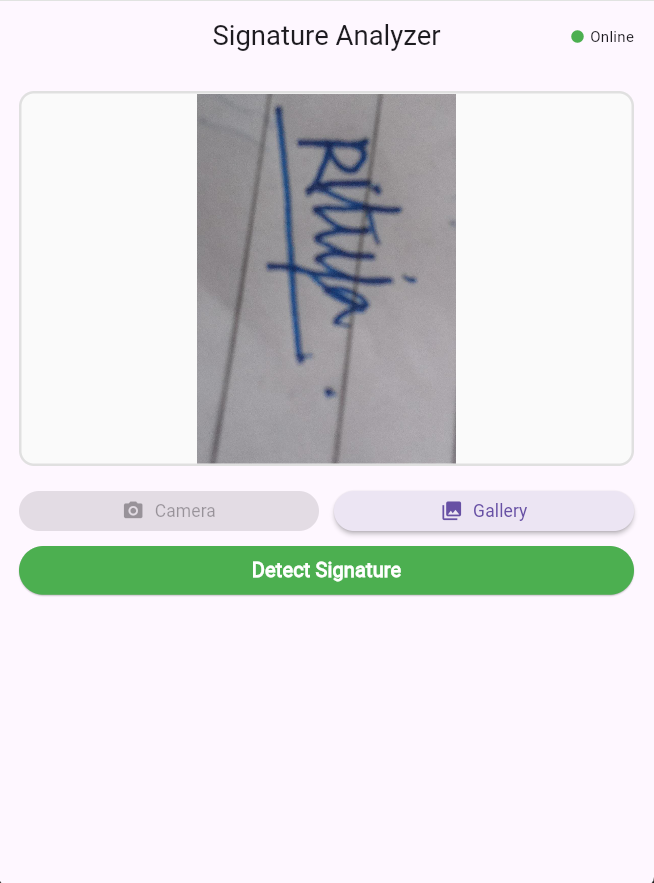
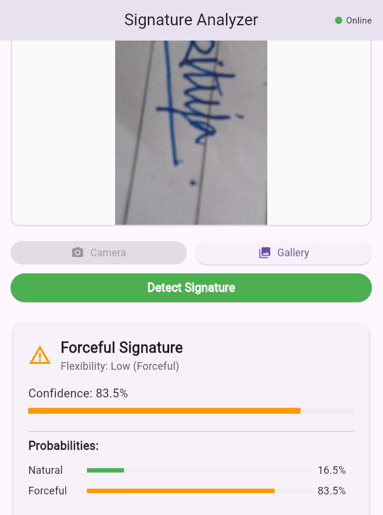
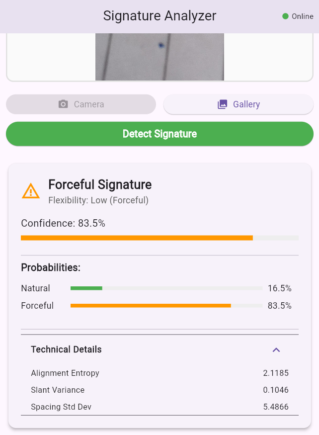

# Signature Analyzer

A comprehensive application for analyzing digital signatures combining machine learning backend with a Flutter mobile frontend. This application detects signature authenticity by determining if signatures were written forcefully or naturally, with detailed analysis including confidence scores and technical features.

## Overview

**Signature Analyzer** is a full-stack application that leverages machine learning to analyze digital signatures across multiple platforms including iOS, Android, Web, Linux, macOS, and Windows. The system provides real-time analysis with a user-friendly interface and detailed technical metrics.

---

## Dataset

The dataset used for training and evaluation was **self-collected and published on Mendeley Data**:

- **Dataset Link**: [https://data.mendeley.com/datasets/2nm9cp89df/1](https://data.mendeley.com/datasets/2nm9cp89df/1)
- **Description**: Self-collected signature dataset for authentication and forceful detection
- **Access**: Publicly available for research and educational purposes

---

## Features

- **Image Upload**: Capture signatures via camera or select from gallery
- **Real-time Analysis**: Instant detection of signature characteristics
- **Confidence Scores**: Get probability assessments for signature authenticity
- **Detailed Metrics**: View technical features including:
  - Alignment entropy
  - Slant variance
  - Pressure distribution
  - Stroke consistency
- **Multi-Platform Support**: Works on iOS, Android, Web, Linux, macOS, and Windows
- **User-Friendly Interface**: Clean, intuitive design with Material 3 styling
- **API Integration**: Connects to a FastAPI backend for signature analysis

---

## Project Structure

```
signature-analyzer/
├── README.md                      # Main project documentation
├── backend/                       # FastAPI Python backend for signature analysis
│   ├── app.py                    # FastAPI application
│   ├── requirements.txt          # Python dependencies
│   ├── entropy_model_final.joblib # Pre-trained ML model
│   └── scaler.joblib             # Feature scaler
├── flutter_frontend/              # Flutter mobile and desktop application
│   ├── README.md                 # Frontend-specific documentation
│   ├── pubspec.yaml              # Flutter dependencies
│   ├── lib/                      # Dart source code
│   │   ├── main.dart            # Application entry point
│   │   └── config/              # Configuration files
│   ├── android/                 # Android-specific files
│   ├── ios/                     # iOS-specific files
│   ├── web/                     # Web platform files
│   ├── windows/                 # Windows platform files
│   ├── linux/                   # Linux platform files
│   └── macos/                   # macOS platform files
├── model_training/               # ML model training and evaluation
│   ├── Training.py              # Training scripts
│   └── Dataset_Link             # Dataset references
└── screenshots/                  # Project screenshots
```

---

## Components

### Flutter Frontend (`flutter_frontend/`)
- **Multi-Platform Support**: iOS, Android, Web, Linux, macOS, and Windows
- **Real-time Communication**: Connects to FastAPI backend for signature analysis
- **Material 3 Design**: Modern, responsive user interface
- **Image Handling**: Camera capture and gallery selection functionality
- **Result Visualization**: Displays analysis results with confidence metrics

### Backend (`backend/`)
- **FastAPI-based REST API**: High-performance asynchronous API server
- **Machine Learning Integration**: Pre-trained models for signature analysis
  - Entropy model (`entropy_model_final.joblib`)
  - Feature scaler (`scaler.joblib`)
- **Feature Extraction**: Processes signature images to extract relevant features
- **Endpoints**:
  - `GET /health` - API health check
  - `POST /predict` - Analyze signature image

### Model Training (`model_training/`)
- Machine learning model development and training
- Data preprocessing and feature engineering
- Model evaluation and validation
- Uses self-collected dataset from Mendeley

---

## Getting Started

### Prerequisites
- **Python**: 3.8 or higher (for backend)
- **Flutter SDK**: 3.8.0 or higher (for frontend development)
- **Dart SDK**: Included with Flutter
- **Docker**: Optional (for containerized deployment)
- **Android Studio or VS Code**: For development

### Backend Setup

```bash
# Navigate to backend directory
cd backend

# Install Python dependencies
pip install -r requirements.txt

# Run the FastAPI server
python app.py
```

The API will be available at `http://localhost:8000`

**API Documentation**: Visit `http://localhost:8000/docs` for interactive API documentation

### Frontend Setup

```bash
# Navigate to frontend directory
cd flutter_frontend

# Get Flutter dependencies
flutter pub get

# Configure API endpoint
cp lib/config/api_config.template.dart lib/config/api_config.dart
# Edit lib/config/api_config.dart with your API base URL

# Run the application
flutter run
```

### Usage

1. **Launch the Application**: Open the app on your device or simulator
2. **Upload Signature Image**:
   - Tap "Gallery" to select an existing signature image
   - Tap "Camera" to capture a new signature
3. **Analyze**: Tap "Analyze Signature" to process the image
4. **View Results**:
   - Check if signature is "Forceful" or "Natural"
   - View confidence percentage
   - Expand "Technical Details" for advanced metrics

---

## Technologies Used

### Frontend
- **Flutter**: Cross-platform UI framework
- **Dart**: Programming language
- **Material Design 3**: UI design system

### Backend
- **FastAPI**: Modern Python web framework
- **Python**: 3.8+
- **Scikit-learn**: Machine learning library
- **Joblib**: Model serialization

### Machine Learning
- **Scikit-learn**: ML algorithms and preprocessing
- **NumPy/Pandas**: Data processing
- **Joblib**: Model persistence

### Deployment
- **Docker**: Containerization
- **Docker Compose**: Multi-container orchestration (optional)

---

## API Configuration

Configure the FastAPI backend connection in `flutter_frontend/lib/config/api_config.dart`:

```dart
class ApiConfig {
  static const String baseUrl = 'http://your-api-endpoint.com';
  static const int timeout = 30; // seconds
  static const bool enableLogging = false;
}
```

### API Endpoints

| Method | Endpoint | Description |
|--------|----------|-------------|
| GET | `/health` | Check API health status |
| POST | `/predict` | Analyze signature image and return results |

---

## Screenshots

### Home Screen

*The main interface showing the image upload area and analysis options.*

### Analysis Results

*Detailed results showing whether the signature is forceful or natural, with confidence scores.*

### Technical Details

*Expanded view showing technical features like alignment entropy and slant variance.*

---

## Installation & Deployment

### Local Development
Follow the "Getting Started" section above.

### Docker Deployment
```bash
cd backend
docker build -t signature-analyzer-backend .
docker run -p 8000:8000 signature-analyzer-backend
```

### Flutter Web Deployment
```bash
cd flutter_frontend
flutter build web --release
```

---

## Contributing

Contributions are welcome! Please feel free to submit a Pull Request.

---

## License

MIT License

---

## Author

**Rituja**

For questions or support, please refer to the dataset documentation at [Mendeley Data](https://data.mendeley.com/datasets/2nm9cp89df/1).

---

## References

- Dataset: https://data.mendeley.com/datasets/2nm9cp89df/1
- Flutter Documentation: https://flutter.dev
- FastAPI Documentation: https://fastapi.tiangolo.com
- Scikit-learn Documentation: https://scikit-learn.org
